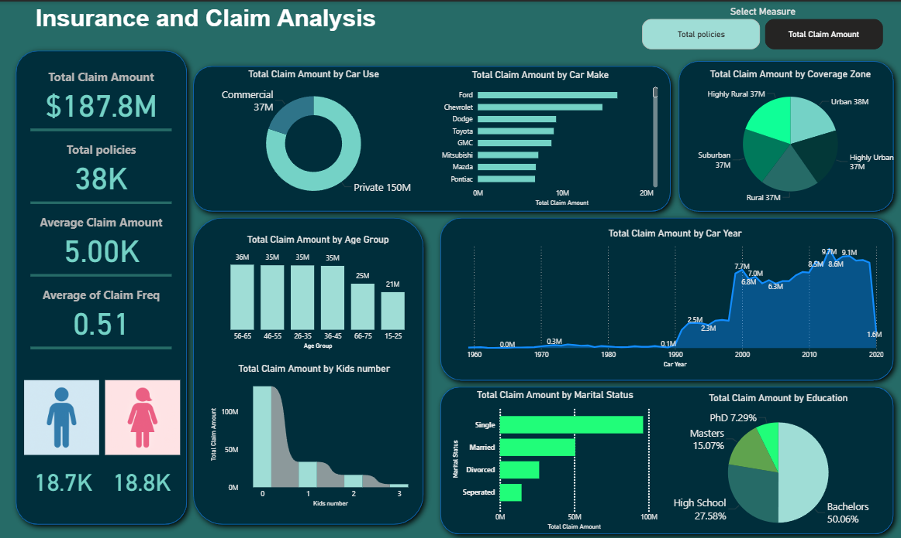

# Insurance-Company-Analytics
Insurance Company Analytics is a Power BI and Excel project focused on evaluating customer demographics, total policies, and total claims. Using Excel for data preparation and Power BI for visualization, the project highlights overall company performance and key metrics to support better business decisions.

## 📸 Screenshots

  
